# Инструкция по работе с GIT

## Содержание инструкции:  
[Общие команды Git](#общие-команды-git)
>[Создание репозитория](#чтобы-создать-репозиторий-мы-используем-команду)  
[Добавление файла в репозиторий](#чтобы-добавить-файл-в-репозиторий-мы-используем-команды)  
[Создание коммитов](#чтобы-сохранить-версию-с-изменениями-в-репозитории-используем-команду)  
[Получение и просмотр созданных коммитов](#чтобы-просмотреть-добавленные-нами-коммиты-используем-команду)  
[Переключение между коммитами](#чтобы-переключиться-на-любую-из-предыдущих-версий-проекта-используем-команду)

[Работа с ветками](#блок-по-работе-с-ветками)
>[Вывод списка веток](#чтобы-вывести-список-имеющихся-в-проекте-веток-используем-команду)  
[Создание новой ветки](#чтобы-создать-в-проекте-новую-ветку-используем-команду)  
[Переключение на ветку](#чтобы-переключиться-на-другую-ветку-используем-команду)  
[Удаление ветки](#чтобы-удалить-ненужную-ветку-используем-команду)  
[Затягивание изменений из указанной ветки](#чтобы-затянуть-изменения-из-какой-либо-ветки-используем-команду)  
[Переименование текущей ветки](#чтобы-переименовать-текущую-ветку-используем-команду)  
[Переименование любой имеющейся ветки](#чтобы-переименовать-любую-имеющуюся-в-проекте-ветку-используем-команду)  
[Вывод общего лога по проекту (мастер и все ветки)](#чтобы-вывести-лог-изменений-с-учётом-всех-веток-используем-команду)

[Работа с Github](#блок-по-работе-с-github)
>[Создание локальной копии удалённого репозитория](#чтобы-затянуть-на-локальную-машину-удалённый-репозиторий-и-объединить-с-локальными-изменениями-используем-команду)  
>[Затягивание удалённого репозитория и слияние с локальной версией](#чтобы-затянуть-на-локальную-машину-удалённый-репозиторий-и-объединить-с-локальными-изменениями-используем-команду)

### Общие команды Git

* #### Чтобы создать репозиторий мы используем команду:

>**git init** - создаёт локальный репозиторий

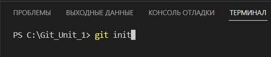
---
* #### Чтобы добавить файл в репозиторий мы используем команды:

>**git add filename** - добавляет указанный файл в репозиторий

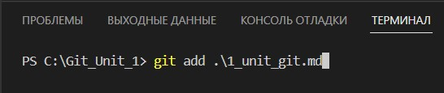  

или 

>**git add .** - добавляет все файлы проекте в репозиторий

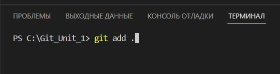
---
* #### Чтобы сохранить версию с изменениями в репозитории используем команду:

>**git commit -m "Comments"** - сохраняет в репозитории версию и присваивает ей хэш-код

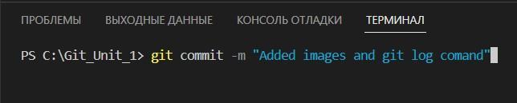
---
* #### Чтобы просмотреть добавленные нами коммиты используем команду :

>**git log** - выводит в терминал список имеющихся коммитов

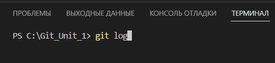
---
* #### Чтобы переключиться на любой из предыдущих коммитов проекта используем команду :

>**git cheсkout hash-code** - переключает проект на выбранный коммит

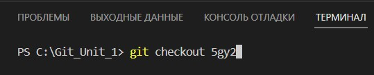

### Блок по работе с ветками

* #### Чтобы вывести список имеющихся в проекте веток используем команду:

>**git branch** - позволяет увидеть список веток проекта.

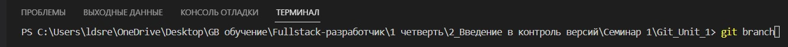
---
* #### Чтобы создать в проекте новую ветку используем команду:

>**git branch name** - команда создаёт новую ветку, но не переходит на неё.

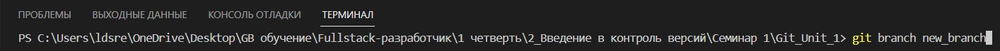
---
* #### Чтобы переключиться на другую ветку используем команду:

>**git checkout name** - команда позволяет переместиться в нужную ветку

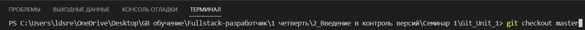
---
* #### Чтобы удалить ненужную ветку используем команду:

>**git branch -d name** - команда удаляет указанную ветку

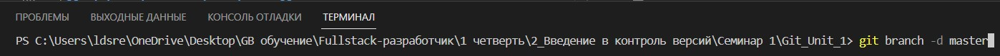
---
* #### Чтобы затянуть изменения из какой-либо ветки используем команду:

>**git merge name** - команда позволяет затянуть в текущую ветку изменения из указанной ветки

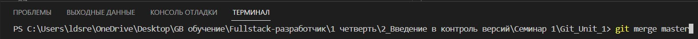
---
* #### Чтобы переименовать текущую ветку используем команду:

>**git branch -m new_branch_name** - переименовывает текущую ветку

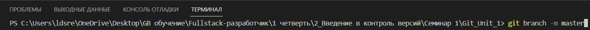
---
* #### Чтобы переименовать любую имеющуюся в проекте ветку используем команду:

>**git branch -m name new_name** - команда позволяет переименовать любую ветку

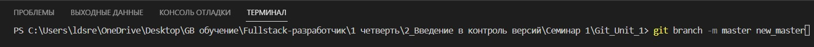
---
* #### Чтобы вывести лог изменений с учётом всех веток используем команду:

>**git log --graph** - команда выводит лог с указанием ветвей (красная - мастер ветка, жёлтая - другие ветки)
---
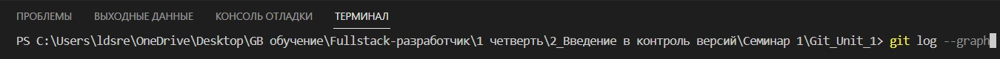

---

### Блок по работе с Github

* #### Чтобы затянуть на локальную машину удалённый репозиторий, используем команду:

>**git clone URL** - создаёт локальную копию удалённого репозитория

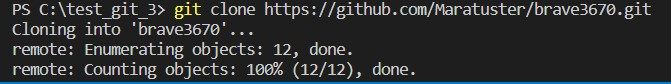
---
* #### Чтобы затянуть на локальную машину удалённый репозиторий и объединить с локальными изменениями используем команду:

>**git pull** - создаёт локальную копию удалённого репозитория сразу объединяя с локальными изменениями

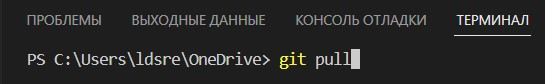
---
* #### Чтобы отправить локальные изменения в удалённый репозиторий используем команду:

>**git push** - отправляет локальные изменения в удалённый репозиторий

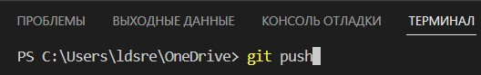
---

### ***Список использованных для выполнения ДЗ ресурсов:***

[gist.github.com](https://gist.github.com/Jekins/2bf2d0638163f1294637/ "Классный ресурс для новичков в MD")  
[denshub.com](https://denshub.com/ru/hugo-post-insert-image/ "Блог обо всё подряд")